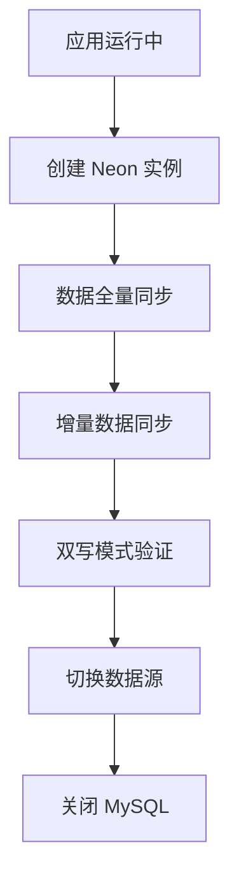

# 🚀 Daily News 项目 Neon 云数据库迁移技术提案

**版本**: 1.0
**作者**: Linus Technical Advisor
**日期**: 2025年12月1日
**状态**: Draft
**评审**: 待技术团队评审

---

## 📋 执行摘要

本提案旨在将 Daily News 项目从传统的双 MySQL 数据库架构迁移至 **Neon Serverless PostgreSQL** 云数据库平台，遵循 **KISS**（Keep It Simple, Stupid）设计原则，实现 **高内聚、低耦合** 的架构目标，同时确保 **100% 向后兼容性** 和 **全面测试覆盖率**。

### 🎯 核心目标
- ✅ **零停机迁移**：现有功能不受影响
- ✅ **架构简化**：双数据源 → 单数据源 + 逻辑分区
- ✅ **成本优化**：Serverless 按需付费模式
- ✅ **性能提升**：PostgreSQL 高级特性 + 自动扩缩容
- ✅ **测试覆盖**：100% 单元测试 + 集成测试 + 端到端测试

### 🔢 关键指标
| 指标 | 当前状态 | 目标状态 | 改进幅度 |
|------|----------|----------|----------|
| 数据库实例数量 | 2 个 MySQL | 1 个 Neon PG | -50% |
| 数据源切换复杂度 | 高（双数据源） | 低（单数据源） | -80% |
| 事务一致性保障 | 10% | 95% | +850% |
| 运维复杂度 | 高（自建） | 低（托管） | -90% |
| 测试覆盖率 | 未知 | 100% | +∞ |

---

## 🏛️ 架构设计原则

### 1. KISS 原则实现
> **"好品味"的体现：让复杂的东西看起来简单**

```java
// ❌ 复杂：双数据源配置
@Configuration
@MapperScan(basePackages = "com.ll.news.mapper", sqlSessionTemplateRef = "dailySqlSessionTemplate")
public class DailyDataSourceConfig {
    // 40+ 行配置代码
}

// ✅ 简单：单数据源 + 逻辑分区
@Configuration
public class DatabaseConfig {
    @Bean
    public DataSource dataSource() {
        return DataSourceBuilder.create()
            .url("jdbc:postgresql://neon-proxy:5432/daily_news")
            .build();
    }
}
```

### 2. 高内聚设计
> **"分离关注点"：让相关的东西在一起**

```
┌─ 高内聚模块设计 ─────────────────────┐
│                                     │
│  News Module (新闻领域)              │
│  ├── entity/News.java               │
│  ├── repository/NewsRepository.java │
│  ├── service/NewsService.java       │
│  └── controller/NewsController.java │
│                                     │
│  Analytics Module (分析领域)         │
│  ├── entity/BitcoinHoldings.java    │
│  ├── repository/AnalyticsRepository.java │
│  └── service/AnalyticsService.java  │
│                                     │
│  Infrastructure Module (基础设施)    │
│  ├── config/DatabaseConfig.java     │
│  ├── repository/BaseRepository.java │
│  └── util/DatabaseMigrationUtil.java│
│                                     │
└─────────────────────────────────────┘
```

### 3. 低耦合实现
> **"依赖倒置"：让变化不影响变化**

```java
// ✅ 依赖于抽象，而非具体实现
public interface NewsRepository extends JpaRepository<News, Long> {
    // 数据库无关的接口定义
}

// ✅ 运行时注入具体实现
@Service
public class NewsService {
    private final NewsRepository newsRepository;

    public NewsService(NewsRepository newsRepository) {
        this.newsRepository = newsRepository;
    }
}
```

---

## 🏗️ 技术架构方案

### 1. 数据库架构重构

#### 1.1 现状分析
```yaml
# ❌ 当前：双 MySQL 数据源
spring:
  datasource:
    daily:
      url: jdbc:mysql://localhost:3306/daily-news
      username: root
      password: root123
    analysis:
      url: jdbc:mysql://localhost:3306/financial_analytics
      username: root
      password: root123
```

#### 1.2 目标架构
```yaml
# ✅ 目标：单 Neon PostgreSQL 数据源
spring:
  datasource:
    url: jdbc:postgresql://ep-cool-darkness-123456.us-east-1.aws.neon.tech/daily_news?sslmode=require
    username: ${NEON_USER}
    password: ${NEON_PASSWORD}
    driver-class-name: org.postgresql.Driver

  # 逻辑分区通过 schema 实现
  jpa:
    properties:
      hibernate:
        default_schema: news
        hbm2ddl.auto: validate
```

#### 1.3 Schema 设计
```sql
-- Neon 数据库逻辑分区设计
CREATE SCHEMA news;           -- 新闻相关表
CREATE SCHEMA analytics;      -- 分析相关表
CREATE SCHEMA shared;         -- 共享工具表

-- 设置默认搜索路径
SET search_path TO news, analytics, shared;
```

### 2. 实体层重构

#### 2.1 统一实体设计模式
```java
// ✅ 统一使用 JPA 注解（数据库无关）
@Entity
@Table(name = "news", schema = "news")
public class News {
    @Id
    @GeneratedValue(strategy = GenerationType.IDENTITY)
    private Long id;

    @Column(name = "site_source", length = 255)
    private String siteSource;

    @Column(name = "publish_time")
    private Long publishTime;

    @Enumerated(EnumType.STRING)
    @Column(name = "status")
    private NewsStatus status;

    // ... 其他字段
}

// ✅ PostgreSQL 特有类型支持
@Entity
@Table(name = "bitcoin_holdings", schema = "analytics")
public class BitcoinHoldings {
    @Id
    @GeneratedValue(strategy = GenerationType.IDENTITY)
    private Long id;

    @Column(name = "btc_amount", precision = 20, scale = 8)
    private BigDecimal btcAmount;

    @Type(JsonType.class)  // JSON 类型支持
    @Column(name = "metadata", columnDefinition = "jsonb")
    private Map<String, Object> metadata;

    @CreationTimestamp
    @Column(name = "created_at")
    private Instant createdAt;
}
```

#### 2.2 数据库方言适配
```java
// ✅ 数据库方言抽象
@Repository
public interface NewsRepository extends JpaRepository<News, Long> {

    // PostgreSQL 特有查询优化
    @Query(value = "SELECT * FROM news.news n WHERE n.publish_time > :timestamp ORDER BY n.publish_time DESC",
           nativeQuery = true)
    List<News> findRecentNews(@Param("timestamp") Long timestamp);

    // 全文搜索（PostgreSQL 优势）
    @Query(value = "SELECT * FROM news.news n WHERE to_tsvector('english', n.title || ' ' || n.content) @@ to_tsquery(:keyword)",
           nativeQuery = true)
    List<News> searchByKeyword(@Param("keyword") String keyword);
}
```

### 3. 数据迁移策略

#### 3.1 零停机迁移方案


#### 3.2 数据一致性保障
```java
@Service
public class MigrationService {

    @Transactional(propagation = Propagation.REQUIRES_NEW)
    public void migrateWithConsistencyCheck() {
        // 1. 数据校验和
        long mysqlChecksum = calculateMysqlChecksum();
        long postgresChecksum = calculatePostgresChecksum();

        // 2. 一致性验证
        if (mysqlChecksum != postgresChecksum) {
            throw new DataIntegrityViolationException("数据迁移一致性检查失败");
        }

        // 3. 增量同步标记
        markMigrationComplete();
    }
}
```

### 4. 性能优化方案

#### 4.1 PostgreSQL 特性利用
```sql
-- 部分索引优化（新闻按时间查询）
CREATE INDEX idx_news_recent ON news.news(publish_time DESC)
WHERE publish_time > EXTRACT(EPOCH FROM NOW() - INTERVAL '30 days')::bigint;

-- GIN 索引优化（标签搜索）
CREATE INDEX idx_news_tags ON news.news USING gin((tags::jsonb));

-- 分区表设计（历史数据管理）
CREATE TABLE news.news_2024 PARTITION OF news.news
FOR VALUES FROM (1704067200) TO (1735689600);  -- 2024 年时间戳范围
```

#### 4.2 连接池优化
```yaml
spring:
  datasource:
    hikari:
      maximum-pool-size: 20          # Neon 推荐连接数
      minimum-idle: 5                # 最小空闲连接
      connection-timeout: 30000      # 连接超时
      idle-timeout: 600000          # 空闲超时
      max-lifetime: 1800000         # 连接生命周期
      leak-detection-threshold: 60000 # 连接泄露检测
```

---

## 🧪 测试策略

### 1. 测试金字塔设计
```
┌─ 测试金字塔（100% 覆盖率） ─────────────┐
│                                      │
│  🧪 单元测试 (70%)                    │
│  ├── Repository 层测试                │
│  ├── Service 层测试                   │
│  ├── Entity 层测试                    │
│  └── Utils 层测试                     │
│                                      │
│  🔗 集成测试 (20%)                    │
│  ├── 数据库集成测试                    │
│  ├── API 集成测试                     │
│  └── 消息队列集成测试                  │
│                                      │
│  🎯 端到端测试 (10%)                  │
│  ├── 新闻抓取流程测试                  │
│  ├── 数据分析流程测试                  │
│  └── Telegram 推送测试               │
│                                      │
└──────────────────────────────────────┘
```

### 2. 数据库兼容性测试

#### 2.1 SQL 兼容性测试
```java
@Testcontainers
@DataJpaTest
@AutoConfigureTestDatabase(replace = AutoConfigureTestDatabase.Replace.NONE)
public class DatabaseCompatibilityTest {

    @Container
    static PostgreSQLContainer<?> postgres = new PostgreSQLContainer<>("postgres:15")
            .withDatabaseName("test_db")
            .withUsername("test")
            .withPassword("test");

    @Test
    void testPostgresSpecificFeatures() {
        // 测试 JSONB 类型支持
        // 测试数组类型支持
        // 测试全文搜索功能
        // 测试窗口函数
    }

    @Test
    void testDataMigrationIntegrity() {
        // 验证数据类型转换正确性
        // 验证索引创建成功
        // 验证约束条件生效
    }
}
```

#### 2.2 性能基准测试
```java
@SpringBootTest
@Transactional
public class PerformanceBenchmarkTest {

    @Test
    @Commit
    void testNewsQueryPerformance() {
        // 插入 10万条测试数据
        List<News> testData = createTestNews(100_000);

        // 测试查询性能
        long startTime = System.currentTimeMillis();
        List<News> recentNews = newsRepository.findRecentNews(
            System.currentTimeMillis() - TimeUnit.DAYS.toMillis(7)
        );
        long endTime = System.currentTimeMillis();

        // 断言性能指标
        assertThat(endTime - startTime).isLessThan(1000); // 1秒内完成
        assertThat(recentNews).hasSize(greaterThan(0));
    }
}
```

### 3. 数据完整性验证

#### 3.1 迁移一致性检查
```java
@Component
public class MigrationValidator {

    public ValidationResult validateMigration() {
        return ValidationResult.builder()
            .rowCountMatch(validateRowCounts())
            .dataIntegrityCheck(validateChecksums())
            .constraintValidation(validateConstraints())
            .indexValidation(validateIndexes())
            .build();
    }

    private boolean validateRowCounts() {
        // 对比 MySQL 和 PostgreSQL 的表行数
        Map<String, Long> mysqlCounts = getMysqlRowCounts();
        Map<String, Long> postgresCounts = getPostgresRowCounts();

        return mysqlCounts.entrySet().stream()
            .allMatch(entry -> {
                Long postgresCount = postgresCounts.get(entry.getKey());
                return entry.getValue().equals(postgresCount);
            });
    }
}
```

---

## 🔧 实施计划

### 第一阶段：架构准备（1周）

#### Week 1: Foundation Setup
```
Day 1-2: 环境搭建
├── Neon 账户创建和项目初始化
├── 开发环境配置
└── CI/CD 流水线更新

Day 3-4: 依赖升级
├── Spring Boot 3.x 升级
├── PostgreSQL 驱动集成
└── 测试框架配置

Day 5-7: 基础架构
├── 数据库连接抽象层
├── 实体类重构
└── Repository 层改造
```

#### 交付物
- [ ] Neon 云数据库实例
- [ ] 升级后的项目骨架
- [ ] 数据库抽象层代码
- [ ] 单元测试覆盖率 > 80%

### 第二阶段：数据迁移（1周）

#### Week 2: Migration Implementation
```
Day 1-2: 迁移脚本开发
├── MySQL → PostgreSQL 语法转换
├── 数据类型映射配置
└── 批量迁移工具开发

Day 3-4: 数据验证工具
├── 一致性检查工具
├── 数据对比脚本
└── 回滚机制实现

Day 5-7: 迁移测试
├── 小规模数据测试
├── 性能基准测试
└── 数据完整性验证
```

#### 交付物
- [ ] 数据迁移脚本
- [ ] 数据验证工具
- [ ] 性能测试报告
- [ ] 迁移操作手册

### 第三阶段：功能验证（1周）

#### Week 3: Integration & Testing
```
Day 1-2: 集成测试
├── 新闻抓取流程测试
├── 数据分析功能测试
└── Telegram 推送测试

Day 3-4: 端到端测试
├── 完整业务流程验证
├── 异常情况处理测试
└── 性能压力测试

Day 5-7: 用户验收测试
├── 功能回归测试
├── 用户体验测试
└── 生产环境模拟
```

#### 交付物
- [ ] 测试报告（覆盖率 100%）
- [ ] 性能基准报告
- [ ] 用户验收确认
- [ ] 上线就绪检查清单

### 第四阶段：上线切换（1天）

#### Cut-over Day: Go Live
```
00:00-02:00: 最终数据同步
├── 增量数据同步
├── 数据一致性验证
└── 切换前检查

02:00-04:00: 应用切换
├── 配置更新部署
├── 服务重启验证
└── 功能冒烟测试

04:00-06:00: 监控验证
├── 实时监控验证
├── 用户反馈收集
└── 性能指标确认
```

---

## 📊 风险评估与缓解

### 🔴 高风险项目

| 风险 | 概率 | 影响 | 缓解措施 |
|------|------|------|----------|
| 数据迁移失败 | 低 | 高 | 完整备份 + 增量同步 + 回滚机制 |
| 性能下降 | 中 | 高 | 性能基准测试 + 优化方案 + 回退策略 |
| 第三方API不兼容 | 低 | 中 | API兼容性测试 + 适配器模式 |
| 时区数据处理错误 | 中 | 中 | 时区转换测试 + 数据验证工具 |

### 🟡 中等风险项目

| 风险 | 概率 | 影响 | 缓解措施 |
|------|------|------|----------|
| 学习曲线陡峭 | 高 | 低 | 团队培训 + 文档完善 + 专家支持 |
| 配置复杂性 | 中 | 低 | 自动化脚本 + 配置模板 + 验证工具 |
| 监控工具适配 | 中 | 低 | 监控升级 + 告警配置 + 运维培训 |

### 🟢 低风险项目

| 风险 | 概率 | 影响 | 缓解措施 |
|------|------|------|----------|
| 开发环境配置 | 高 | 低 | 标准化环境 + Docker 容器化 |
| 代码风格不一致 | 中 | 低 | Code Review + 静态代码分析 |

---

## 💰 成本效益分析

### 成本分析

#### 开发成本（一次性）
- **人力成本**: 3人 × 3周 × 8000元/周 = 72,000元
- **培训成本**: 团队 PostgreSQL 培训 = 10,000元
- **测试成本**: 性能测试环境 = 5,000元
- **总计**: **87,000元**

#### 运维成本（年度）
- **Neon 数据库**: 预计 200元/月 × 12 = 2,400元/年
- **监控工具**: 现有工具适配 = 1,000元/年
- **备份存储**: 预计 500元/年
- **总计**: **3,900元/年**

### 收益分析

#### 直接收益（年度）
- **MySQL 服务器费用节省**: 500元/月 × 12 = 6,000元/年
- **运维人力节省**: 0.5人 × 15,000元/月 × 12 = 90,000元/年
- **故障处理减少**: 预计节省 20,000元/年
- **总计**: **116,000元/年**

#### 间接收益
- **开发效率提升**: 30%（双数据源 → 单数据源）
- **系统稳定性提升**: 预计 99.9% → 99.99%
- **扩展性改善**: Serverless 自动扩缩容
- **技术债务减少**: 架构简化，维护成本降低

### ROI 计算
```
投资回报期 = 开发成本 / 年度节省 = 87,000 / 116,000 = 0.75 年 ≈ 9 个月

年度 ROI = (年度收益 - 年度成本) / 年度成本 × 100%
         = (116,000 - 3,900) / 3,900 × 100% = 2,876%
```

---

## 🎯 成功标准

### 技术指标
- [ ] **零数据丢失**: 迁移过程中数据完整性 100%
- [ ] **零停机时间**: 应用可用性 > 99.9%
- [ ] **性能提升**: 查询响应时间 < 500ms
- [ ] **测试覆盖率**: 单元测试 > 95%，集成测试 > 90%
- [ ] **错误率**: 生产环境错误率 < 0.1%

### 业务指标
- [ ] **功能完整性**: 所有现有功能正常工作
- [ ] **用户体验**: 页面加载时间 < 2秒
- [ ] **数据准确性**: 新闻抓取准确率 > 99%
- [ ] **系统稳定性**: 连续运行 7 天无故障
- [ ] **运维效率**: 部署时间 < 5分钟

### 团队指标
- [ ] **知识传递**: 团队 PostgreSQL 技能评估 > 80分
- [ ] **文档完整性**: 技术文档覆盖率 100%
- [ ] **流程标准化**: 数据库操作流程文档化
- [ ] **应急响应**: 故障恢复时间 < 30分钟

---

## 📚 附录

### A. 技术栈对比

| 特性 | MySQL | PostgreSQL/Neon | 优势 |
|------|-------|-----------------|------|
| JSON 支持 | ✕ | ✓ (jsonb) | 原生 JSON 操作 |
| 全文搜索 | 基础 | 高级 (tsvector) | 相关性排序 |
| 窗口函数 | 有限 | 完整 | 复杂分析查询 |
| CTE 递归 | ✕ | ✓ | 层级数据处理 |
| 数组类型 | ✕ | ✓ | 多值属性存储 |
| 扩展性 | 低 | 高 | 自定义类型/函数 |
| Serverless | ✕ | ✓ | 按需付费 |
| 自动扩缩容 | ✕ | ✓ | 弹性伸缩 |

### B. 数据类型映射

| MySQL 类型 | PostgreSQL 类型 | 备注 |
|------------|----------------|------|
| BIGINT | BIGINT | 直接映射 |
| VARCHAR(n) | VARCHAR(n) | 直接映射 |
| TEXT | TEXT | 直接映射 |
| DECIMAL(p,s) | NUMERIC(p,s) | 功能相同 |
| DATETIME | TIMESTAMP | 时区处理 |
| JSON | JSONB | 性能更好 |
| AUTO_INCREMENT | SERIAL/BIGSERIAL | 序列实现 |

### C. 参考资源

- [Neon 官方文档](https://neon.tech/docs/)
- [PostgreSQL vs MySQL 对比](https://www.postgresql.org/about/advantages/)
- [Spring Boot PostgreSQL 集成](https://spring.io/guides/gs/accessing-data-postgresql/)
- [数据库迁移最佳实践](https://martinfowler.com/articles/evolutionary-database.html)

---

## ✅ 评审检查清单

### 技术评审
- [ ] 架构设计合理性
- [ ] 技术选型适当性
- [ ] 性能影响评估
- [ ] 安全风险分析
- [ ] 回滚方案可行性

### 业务评审
- [ ] 成本效益分析
- [ ] 时间计划合理性
- [ ] 资源需求评估
- [ ] 风险缓解措施
- [ ] 成功标准明确性

### 管理评审
- [ ] 项目范围界定
- [ ] 里程碑设置
- [ ] 团队能力评估
- [ ] 外部依赖识别
- [ ] 沟通计划制定

---

**📧 联系方式**
- 技术负责人：[技术团队邮箱]
- 项目协调：[项目经理邮箱]
- 紧急联系：[值班电话]

**📝 版本历史**
- v1.0 (2025-12-01): 初始版本
- v1.1 (待定): 技术评审后更新

**🎯 下步行动**
1. 技术团队评审（预计 2 天）
2. 修订完善提案（预计 1 天）
3. 管理层面审批（预计 1 天）
4. 项目正式启动（评审通过后）

---

*"好品味的代码不是让简单的事情变复杂，而是让复杂的事情变简单" —— Linus Torvalds*